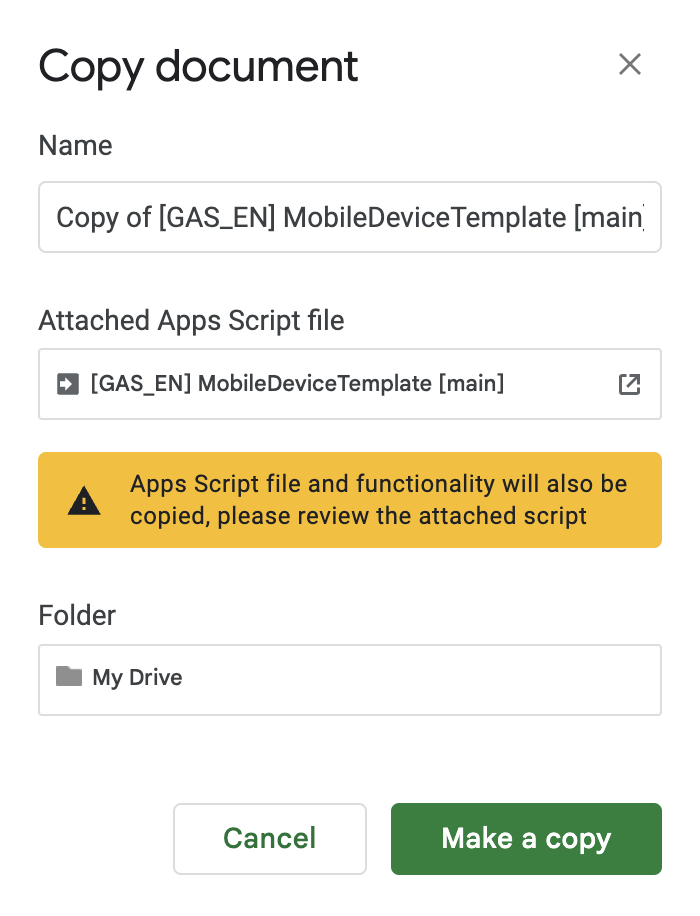
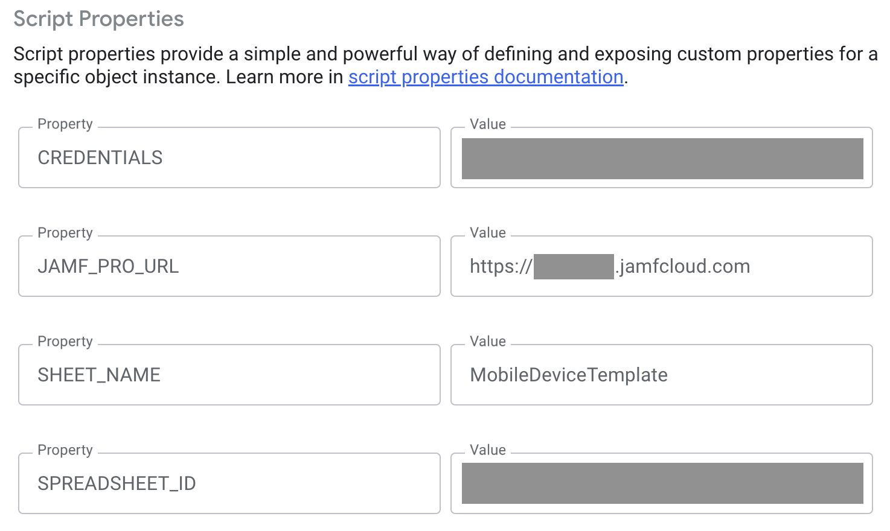
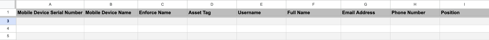
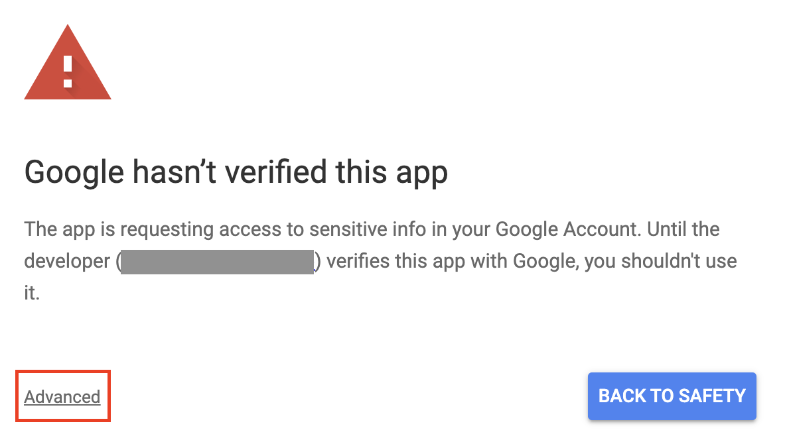
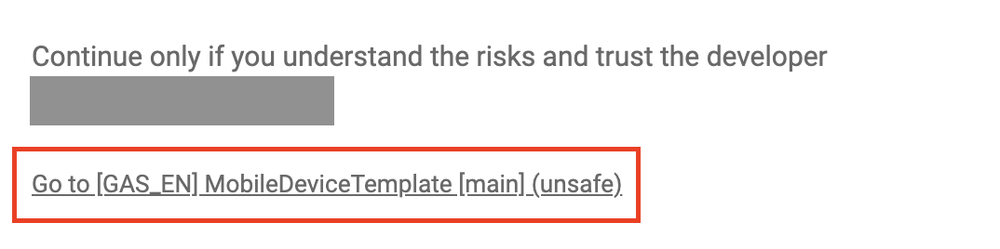
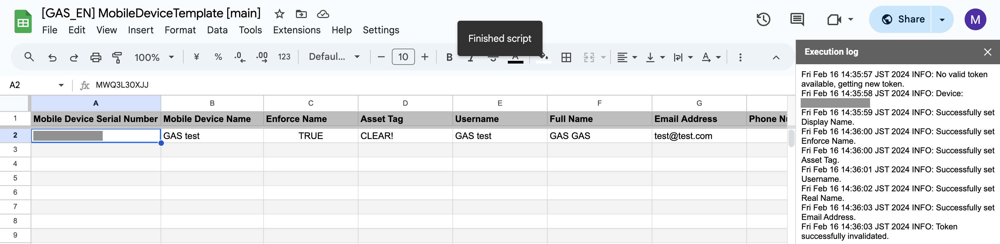

# GoogleAppsScript-for-Jamf
This program utilizes a combination of Google Sheets, Google Apps Script, and the Jamf Pro API.  
Based on information within the spreadsheet, the program makes API calls to update relevant data within the specified Jamf Pro instance.

日本語版は README_JA.md にあります。

**Always run a small test update on just a couple devices to make sure your updates are working as intended.**

- [Introduction](#introduction)
- [Beginning Steps](#beginning-steps)
  - [Google Account](#google-account)   
  - [Jamf Pro](#jamf-pro)
    - [API Account](#api-account)
  - [Google Spreadsheet](#google-spreadsheet)
    - [Make A Copy](#make-a-copy)
    - [Initial Settings](#initial-settings)
- [Data Input](#data-input)
  - [Updating Attributes](#updating-attributes)
  - [Updating Extension Attributes](#updating-extension-attributes)
  - [Clearing Existing Attributes](#clearing-existing-attributes)
- [First Run](#first-run)
- [Mass Updating](#mass-updating)
- [Test Environments](#test-environments)

## [Introduction](#introduction)
This mass update tool is a web application written in JavaScript under the Google Apps Script (GAS) web application framework.  
This enables Jamf administrators to perform mass updates for devices within Jamf (currently limited to iOS, iPadOS, and tvOS) and user attributes (such as username, asset tag, or custom attributes, etc).

Since the tool operates within a web browser, it can be used on devices running various operating systems, including Windows, macOS, and iOS.

## [Beginning Steps](#beginning-steps)
To use this tool, please complete the following steps in the appropriate order.
### [Google Account](#google-account)
Access https://www.google.com/accounts/NewAccount and follow the instructions to create an account.  
If you already have an account, there is no need to create a new one.  
​[Reference page for creating a Google Account](https://support.google.com/accounts/answer/27441?hl=en&ref_topic=3382296&sjid=13201858824406738012-EU​)

Log in to your Google account.

### [Jamf Pro](#jamf-pro)
When setting things up for the first time, please follow the steps below in your Jamf Pro environment.

If you prefer to use the "API roles and clients" functionality in Jamf Pro, please navigate to the feature/client-credentials-auth branch.

#### [API Account](#api-account)
In Jamf Pro, create an API user account as follows.

1. Click on the "⚙️" icon (Settings).
2. Click on "User accounts and groups".
3. Click on "New" in the top right corner.
4. Check "Create Standard Account" and click "Next".
5. In the "Account" tab, please configure the following:
   - Username (e.g. api-user)
   - Access Level: Full Access
   - Permission Set: Custom
   - Password

  

6. In the "Privileges" tab, please check the following:
   - **Jamf Pro Server Objects**
     - Mobile Devices (Create, Read, Update）
     - Users (Read, Update）
   - **Jamf Pro Server Actions**
     - Assign User to Mobile Devices
     - Send Mobile Device Set Device Name Command
7. Click "Save".

### [Google Spreadsheet](#google-spreadsheet)

#### [Make A Copy](#make-a-copy)
1. Access the following link:
   - https://docs.google.com/spreadsheets/d/1weWvtPcZa61bRxfyGHFkK7_8iByOEFvT_d3avg_S0fU
2. Click on "File" > "Make a copy".
3. Configure the settings in the "Copy document" popup:
   - Name: Change it as you please
   - Apps Script File: To make the mass update work, we use a script. If you would like to review it, click on it.
   - Folder: My Drive (leave it as is)
4. Click on "Make a copy".
5. The copied spreadsheet will automatically open in a new tab.  

_Note: The copied spreadsheet is saved in your Google account's Drive, allowing you to access it from your Drive in the future._

#### [Initial Settings](#initial-settings)
Please open the copied spreadsheet and follow these initial setup steps:

1. Click on "Extensions" > "Apps Script".
2. Click on the "⚙️" icon in the middle left of the screen (Project Settings).
3. Click on "Add script property" at the bottom.
4. Configure as shown below then click "Save".

| Property | Value |
| :---   | :---   |
| JAMF_PRO_URL | https://instance-name.jamfcloud.com |
| CREDENTIALS | CreatedJamfAPIUsername:JamfPassword Example: If the username is "aaa" and the password is "bbb," it should be "aaa:bbb". |
| SHEET_NAME | MobileDeviceTemplate |
| SPREADSHEET_ID | The ID of the copied spreadsheet (see the instructions below on how to obtain it) |

You can extract the spreadsheet ID from the URL. For example, if the URL is https://docs.google.com/spreadsheets/d/abc1234567/edit#gid=0, the spreadsheet ID would be 'abc1234567'.

## [Data Input](#data-input)

When executing a mass update, validation checks are performed on the spreadsheet's header row. **Please avoid making changes to the header row, such as deleting columns or rearranging them before performing a mass update. Any changes to the header row may potentially disrupt the proper functioning of the tool.**

*Please do not rename the spreadsheet.* Leave the sheet name "MobileDeviceTemplate" at the bottom of the spreadsheet as is.  

### [Updating Attributes](#updating-attributes)
This section explains how to use and input data under each header in the spreadsheet.

- Mobile Device Serial Number [Input required]
  - Enter the serial number of the device for which you want to update inventory information. 

**Attributes that can be updated based on the "General" tab of the "Inventory" in Jamf Pro.**
- Mobile Device Name (This will also update the actual device name.)  
- Enforce Name: Enforce Mobile Device Name
  - Enforce the name → TRUE or do not enforce → FALSE
- Asset Tag
- Site
  - You can use either the Site ID or the Site name.
  - It will not be updated if the Site is non-existent in the Jamf Pro instance.
- AirPlay Password (tvOS)

**Attributes that can be updated based on the "User and Location" tab of the "Inventory" in Jamf Pro.**
- Username
- Full Name
- Email Address
- Phone Number
- Position
- Department
- Building
- Room

**Important Note**  
For the "Department" and "Building" attributes you must input values (strings) that match existing "Department" or "Building" names in your Jamf Pro instance. If you input non-existent "Department" or "Building" values, they will not be updated.

**Attributes that can be updated based on the "Purchasing" tab of the "Inventory" in Jamf Pro.**
- Purchased or Leased: → TRUE for leased → FALSE for purchased
- PO Number
- PO Date
  - yyyy-mm-dd OR yyyy/mm/dd format
- Vendor
- Warranty Expiration
  - yyyy-mm-dd OR yyyy/mm/dd format
- AppleCare ID
- Lease Expiration
  - yyyy-mm-dd OR yyyy/mm/dd format
- Purchase Price

### [Updating Extension Attributes](#updating-extension-attributes)  
It is possible to update Extension Attributes for devices.  
In order to do this, you must first identify the Extension Attribute ID number. 

1. Click on the "⚙️" icon (Settings) in the Jamf Pro GUI.
2. Select Device management > Extension attributes.
3. Click on the EA you want to update.
4. Obtain the ID from the URL of the relevant EA.

For example, the EA ID for this Extension Attribute is "17".  

To update an Extension Attribute, add a new column **after** all the existing columns in the template and put the string "EA_#" in the header, where "#" represents the ID of the EA you want to update.

For example, to update an Extension Attribute with the ID of "17", you would add a new column with the header "EA_17", and place the values of that EA in the column.

Your spreadsheet will look like this:
(For simplicity not all columns are shown here. Please **DO NOT** remove any columns from the spreadsheet. Removing columns will cause errors.)

| Mobile Device Serial Number | Mobile Device Name | Enforce Name | Asset Tag | ... | Site (ID or Name) | EA_17 | EA_18
| :---   | :---   |  :---   |  :---   |  :---   |  :---   |  :---  |  :---   |
| A1234567 | | TRUE | MH-12 | | | New Value | New Value |
| B1234567 | | FALSE | MH-15 | | | New Value | New Value |

### [Clearing Existing Attributes](#clearing-existing-attributes)
As another feature of the tool, you can clear existing attributes. This occurs, for example, when a device group is reassigned to new users, or when it's retired and user information needs to be removed.

To clear a value, you need to use a specific string, which is currently "CLEAR!"

**Important Note**  
Mobile Device Name, PO Date, Warranty Expiration, and Lease Expiration are not subject to this.

When clearing user information from a device, the spreadsheet will look like this (columns continue after the ellipsis).

| Mobile Device Serial | Mobile Device Name | Enforce Name | Asset Tag | ... | Site (ID or Name) | EA_17 | EA_18
| :---   | :---   |  :---   |  :---   |  :---   |  :---   |  :---  |  :---   |
| A1234567 | | CLEAR! | CLEAR! | | CLEAR! | CLEAR! | CLEAR! |
| B1234567 | | CLEAR! | CLEAR! | | CLEAR! | CLEAR! | CLEAR! |

## [First Run](#first-run)
1. Open the copied spreadsheet.
2. Enter the data you want to update.
3. Click on "Settings" in the menu to the right of Help, and then select "Run".  
  

4. Authorization is required the first time you run it (see the image below).  Click the "OK" button.  

5. Select your Google account.
   When you see "Google hasn't verified this app" click on "Advanced".  

6. After clicking "Advanced", click on "Go to [GAS_EN] MobileDeviceTemplate (unsafe)".  

7. Finally, click "Allow".  

*At the very first run, mass updates are NOT performed.*  
*You have to click "Settings" > "Run" once again to perform the mass update.*

## [Mass Updating](#mass-updating)
1. Open the copied spreadsheet.
2. Enter the data you want to update.
3. Click on "Settings" in the menu to the right of Help, and then select "Run".

Updating in progress ↓  

After the update is complete, a sidebar with logs will open on the right.  
Update completed ↓  

When clicking the "Settings" > "Run" button, you may occasionally encounter the following error.  
  
In this case, please try the following:  
Click "Dismiss".  
Wait for 5-10 seconds.  
Press "Settings" > "Run" again.

## [Test Environments](#test-environments)
The tool has been tested with the following environments.

macOS 14.4.1  
・Google Chrome v.123.0.6312.59, EN・JA  
・Firefox v.124.0.1 (64-bit) EN・JA  

iPadOS 16.7.7  
・Safari 16.7.7, EN

Windows 11 (arm)  
・Google Chrome v.123.0.6312.59, JA  
・Microsoft Edge v.122.0.2365.92, JA

Windows 10 (x86)  
・Google Chrome v.123.0.6312.59, EN・JA  
・Microsoft Edge v.122.0.2365.92, EN・JA  
・Firefox v.124.0.1 (64-bit), EN・JA 
