# GoogleAppsScript-for-Jamf
このプログラムは、スプレッドシート、Google Apps Script および Jamf Pro の API の組み合わせを利用します。  
スプレッドシート内の情報に基づいて、プログラムは API 呼び出しを行い、ユーザーが指定した Jamf Pro インスタンス内の関連情報を更新します。

**アップデートが意図したとおりに機能することを確認するために、最初は必ず数台のデバイスのみでテスト更新を実行してください。**

- [Introduction](#introduction)
- [Beginning Steps](#beginning-steps)
  - [Google Account](#google-account)   
  - [Jamf Pro](#jamf-pro)
    - [API Setup](#api-setup)
      - [API Account](#api-account)
      - [API Roles and Clients](#api-roles-and-clients)
  - [Google Spreadsheet](#google-spreadsheet)
    - [Make A Copy](#make-a-copy)
    - [Initial Settings](#initial-settings)
- [Data Input](#data-input)
  - [Updating Attributes](#updating-attributes)
  - [Updating Extension Attributes](#updating-extension-attributes)
  - [Clearing Existing Attributes](#clearing-existing-attributes)
- [First Run](#first-run)
- [Mass Updating](#mass-updating)
- [Test Environments](#test-environments)
- [Support](#support)

## [Introduction](#introduction)
この一括更新ツールは、Webアプリケーション フレームワークである Google Apps Script (GAS) の下で JavaScript で書かれた Web アプリケーションです。これにより、Jamf 管理者は、Jamf 内のデバイス (現在は iOS、iPadOS、tvOS 対象のみ) およびユーザーの属性 (ユーザー名、アセットタグ、または拡張属性など) を一括更新できます。 

ツールはブラウザー上で動きますので、OS と関係なく、Windows、macOS、iOS デバイスでも使うことは可能となります。

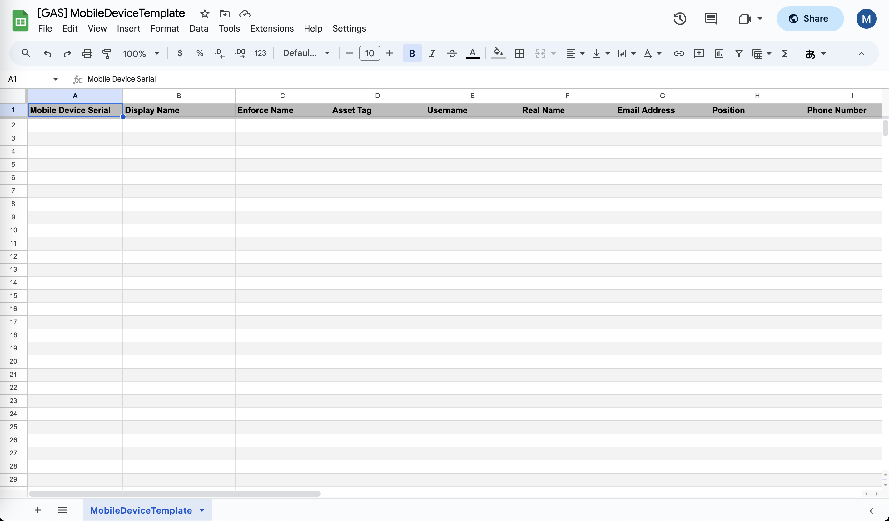

## [Beginning Steps](#beginning-steps)
このツールを使用するには、以下の手順を該当する順序で事前準備を行ってください。
### [Google Account](#google-account)
https://www.google.com/accounts/NewAccount にアクセスします。​指示に従ってアカウントを作成してください。
※既にアカウントをお持ちの場合は、新しいアカウントを作成する必要はありません。​[参照](https://support.google.com/accounts/answer/27441?hl=ja&ref_topic=3382296&sjid=12686068683038764892-AP​)

Googleアカウントにログインします。

### [Jamf Pro](#jamf-pro)
お使いの Jamf Pro において 初めて当作業を実施する際は以下を実施してください。

#### [API Setup](#api-setup)
次のステップでは、2つのオプションがあります：  
API 用ユーザーアカウントを作成することにします。  か   
[API ロールとクライアント](https://learn.jamf.com/ja-JP/bundle/jamf-pro-documentation-current/page/API_Roles_and_Clients.html)機能を使用することにします。  
上のオプションから1つを選んでください。

##### [API Account](#api-account)
API 用ユーザーアカウントを作成したい場合、以下の手順に従って設定してください：

1. 画面左中の「⻭車マーク」をクリック。
2. 「ユーザアカウントとグループ」をクリック。 
3. 画面右上の「新規」をクリック。 
4. 「Create Standard Account」に チェック、次へ押下。
5. アカウントタブにて以下を設定してください。
   - ユーザ名(例）：api-user
   - アクセスレベル：フルアクセス
   - 権限セット：カスタム
   - パスワード

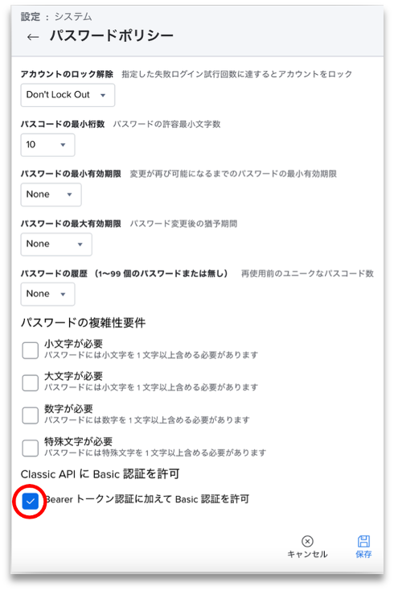

6. 権限タブにて以下にチェックを付けてください。
   - **Jamf Proサーバオブジェクト**
     - Mobile Devices (作成・読み取り・アップデート）
     - ユーザ (読み取り・アップデート）
   - **Jamf Proサーバアクション**
     - モバイルデバイスへのユーザ割当
     - モバイルデバイス名称設定コマンドを送信
7. 「保存」をクリック。

##### [API Roles and Clients](#api-roles-and-clients)
API ロールとクラインとの機能を使いたい場合は、以下の手順に従って設定してください：

1. 画面左中の「⻭車マーク」をクリック。
2. 「API ロールとクライアント」をクリック。 
3. 上の「API ロール」タブをクリック。
4. 画面右上の「新規」をクリック。
5. 「表示名」を入力。
6. 以下の権限を選択してください：
    * Assign Users to Mobile Devices
    * Create Mobile Devices
    * Update Mobile Devices
    * Read Mobile Devices
    * Update User
    * Read User
    * Send Mobile Device Set Device Name Command
7. 「保存」をクリック。

上記の手順で、API ロールは作成されました。

次に、API クライアントを作成する必要があります。  
Jamf Pro API がアクセストークンを生成するためにAPI クライアントを作ります。ここに作成される API クライアントを後で使います。

1. 上の「API クライアント」タブをクリック。
2. 画面右上の「新規」をクリック。
3. 「表示名」を入力。
4. 作成した「API ロール」を割り当てる。
5. 「アクセストークンの有効期限」を設定する。
6. 「Enable API Client」をクリック。
7. 「保存」をクリック。

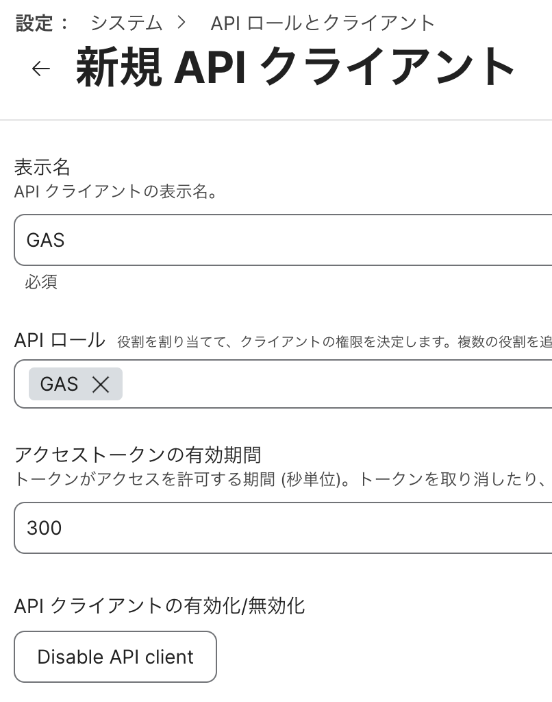

API クライアントを作成した後に、次にクライアントシークレットを生成します。
シークレットはアクセストークンを生成するために重要です。

1. 先ほど作成した「API　クライアント」をクリック。
2. 「クライアントシークレットの生成」をクリック。
3. ポップアップでクライアントシークレットが表示される。

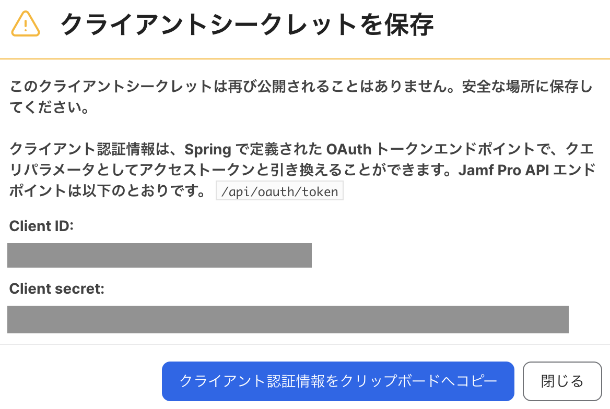

*注意: クライアントシークレットは一度だけ表示されます。*  
*ダイアログを閉じる前に、安全な場所に保存してください。__後で必要になります__。*

### [Google Spreadsheet](#google-spreadsheet)

#### [Make A Copy](#make-a-copy)
1. 以下リンクにアクセス。
   - https://docs.google.com/spreadsheets/d/11nt5WZl4Li5eqEDTPRLaxyqGEsLDQQ_dlJ_V6wXPRCA
2. ファイル > コピーを作成 にクリック。
3. ドキュメントをコピーのプップアップの設定。
   - 名前：変更可能
   - Apps Script ファイル：一括更新を動くために、スクリプトを使います。スクリプトを確認したい場合、クリックするとコードが開けます。
   - フォルダ：マイドライブ（そのままにしてください。）
4. 「 コピーを作成」にクリック。
5. コピーしたスプレッドシートは自動的に新しいタブで開けます。  
※ 使用しているGoogleアカウントのドライブにスプレッドシートは保存されますので、今後ドライブから開くことができます。

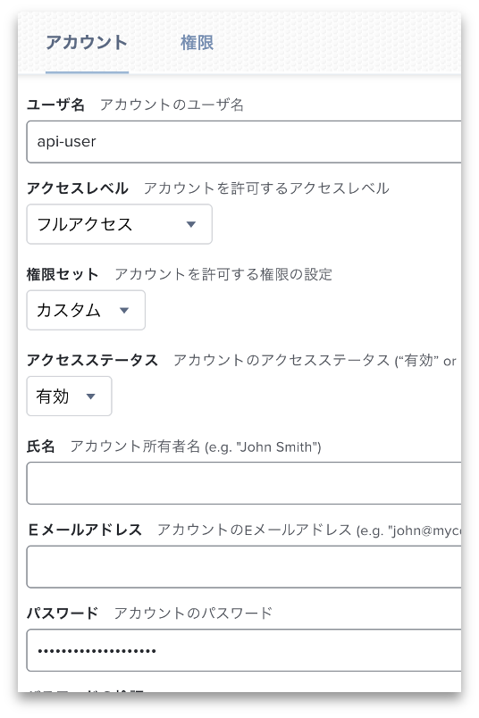

#### [Initial Settings](#initial-settings)
コピーしたスプレッドシートを開いて、以下の手順にそって初期設定を行ってください。

1. 拡張機能 > Apps Script にクリック。
2. 画面左中の「歯車マーク」をクリック。（プロジェクトの設定）
3. 下にある「スクリプト プロパティを追加」にクリック。
4. 以下の内容を設定して「保存」をクリック。

**API アカウント**を作成した場合、以下のプロパティを作成する必要があります：  
JAMF_PRO_URL, CREDENTIALS, SHEET_NAME, SPREADSHEET_ID

**API ロールとクライアント**機能を使用した場合は、以下のプロパティを作成する必要があります：  
JAMF_PRO_URL, CLIENT_ID, CLIENT_SECRET, SHEET_NAME, SPREADSHEET_ID

| プロパティ | 値 |
| :---   | :---   |
| JAMF_PRO_URL | https://インスタンス名.jamfcloud.com |
| CREDENTIALS | 作成したJamfAPIユーザー名:Jamfパスワード 例: ユーザー名がaaa、パスワードがbbbであれば 「aaa:bbb」となる。 |
| CLIENT_ID | ClientIDFromCreatedAPIClient |
| CLIENT_SECRET | ClientSecretGeneratedFromCreatedAPIClient |
| SHEET_NAME | MobileDeviceTemplate |
| SPREADSHEET_ID | コピーしたスプレッドシートID (取得方は以下の説明をご覧） |

スプレッドシート ID は URL から抽出できます。  
例えば、URLは https://docs.google.com/spreadsheets/d/abc1234567/edit#gid=0 の場合、 
スプレッドシート ID は「abc1234567」となります。

Jamf API アカウントを使用する場合：  
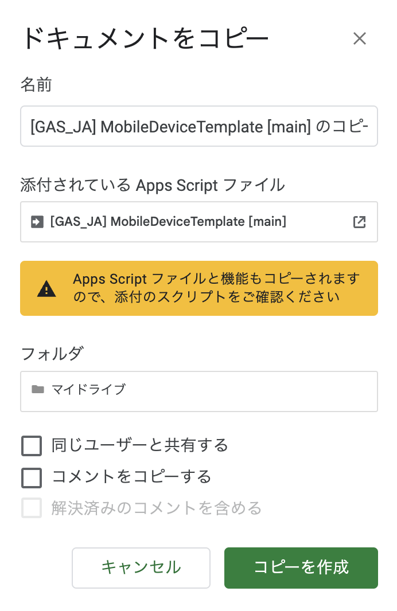

Jamf API ロールとクライアント機能を使用する場合：  
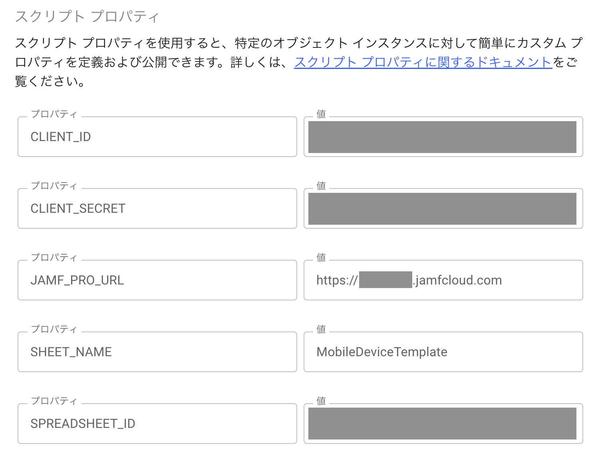

## [Data Input](#data-input)
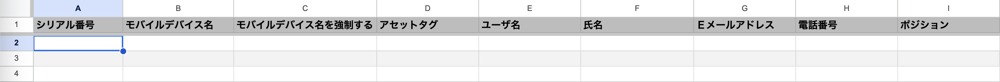

一括更新を実行する時に、スプレッドシートのヘッダー行に対して検証チェックを実行します。一括更新を行う前に、ヘッダー行の変更 (列の削除や列の再配置など) しないようにしてください。 ヘッダー行に変更があれば、一括購入は正常に動かない可能性は高いです。

スプレッドシートの下にあるシート名「MobileDeviceTemplate」はそのままにしてください。  
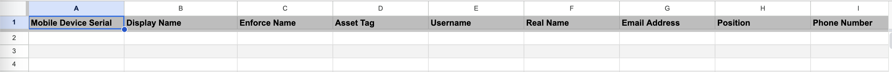

### [Updating Attributes](#updating-attributes)
スプレッドシートにある客ヘッダ名の使い方についてです。

- シリアル番号 [入力必須]
  - インベントリ情報を更新したいデバイスのシリアルナンバーを半角英数文字で入力する。 

**Jamf Pro にてインベントリ画面の「一般」タブで更新可能な項目**
- モバイルデバイス名 (実機のデバイス名も更新される)  
- モバイルデバイス名を強制する
  - デバイス側でデバイス名が変更された時の対応を指定する。
  - 指定値に戻す →「TRUE」or そのままにする →「FALSE」
- アセットタグ 
- サイト
  - ID or サイト名
  - Jamf Pro に登録されていない「サイト」を入力した場合は更新されない。
- AirPlay パスワード (tvOSのみ)

**Jamf Pro にてインベントリ画面の「ユーザと位置」タブで更新可能な項目**
- ユーザ名
- 氏名
- Ｅメールアドレス
- ポジション
- 電話番号
- 部署
- 建物
- ルーム

【注意事項】  
部署、建物 については、Jamf Pro に登録されている  
 「部署」「建物」と同じ値 (文字列) を入力する必要があります。  
 Jamf Pro に登録されていない「部署」「建物」を入力した場合は更新されません。 

**Jamf Pro にてインベントリ画面の「購入」タブで更新可能な項目**
- 購入またはリース　→　リースの場合「TRUE」or そのままにする →「FALSE」
- 購入番号
- 購入日
  - yyyy-mm-dd または yyyy/mm/dd形
- ベンダー
- 品質保証期限
  - yyyy-mm-dd または yyyy/mm/dd形
- AppleCare ID
- リース有効期限
  - yyyy-mm-dd または yyyy/mm/dd形
- 購入価格

### [Updating Extension Attributes](#updating-extension-attributes)  
デバイス用の拡張属性を更新するのは可能です。  
まず拡張属性の ID を特定する必要があります。

1. 画面左中の「歯車マーク」をクリック。
2. デバイス管理 > 拡張属性を選択。
3. 更新する EA をクリック。
4. 該当 EA の URL から ID を取得する。

例えば、ここで表示されている拡張属性のEA IDは「17」です。  

拡張属性を更新するには、テンプレートの既存のすべての列の後に新しい列に独自のヘッダーを追加し、そのヘッダーに文字列「EA_#」を入力します。「#」は更新する EA の ID です。

たとえば、ID が「17」の拡張属性を更新するには、ヘッダーが「EA_17」の新しい列を追加し、その EA の値をその列に配置します。

スプレッドシートは次のようになります。  
(適合させるために一部の列が表示されていません。スプレッドシートから列を削除しないでください)。

| シリアル番号 | モバイルデバイス名 | モバイルデバイス名を強制する | アセットタグ | ... | サイト (ID または Name) | EA_17 | EA_18
| :---   | :---   |  :---   |  :---   |  :---   |  :---   |  :---  |  :---   |
| A1234567 | | TRUE | MH-12 | | | New Value | New Value |
| B1234567 | | FALSE | MH-15 | | | New Value | New Value |

### [Clearing Existing Attributes](#clearing-existing-attributes)  
ツールのもう 1 つの機能として、既存の属性をクリアすることはできます。  
たとえば、デバイスのグループが新しいユーザーに再配布されるか、廃止され、ユーザー名と関連情報を削除する必要がある場合に発生します。

値をクリアするには、特定の文字列を使用する必要があります。  
この文字列は現在「CLEAR!」です。

【注意事項】  
・ 「モバイルデバイス名」、「購入日」、「品質保証期限」、「リース有効期限」 は対象外。

デバイスからユーザー情報を消去する場合、スプレッドシートは次のようになります (省略記号の後に列があります)。

| シリアル番号 | モバイルデバイス名 | モバイルデバイス名を強制する | アセットタグ | ... | サイト (ID または Name) | EA_17 | EA_18
| :---   | :---   |  :---   |  :---   |  :---   |  :---   |  :---  |  :---   |
| A1234567 | | CLEAR! | CLEAR! | | CLEAR! | CLEAR! | CLEAR! |
| B1234567 | | CLEAR! | CLEAR! | | CLEAR! | CLEAR! | CLEAR! |

## [First Run](#first-run)
1. コピーしたスプレッドシートを開く。
2. 更新したいデータを入力する。
3. メニューでヘルプの右にある「設定」> 「実行」 を選択。  
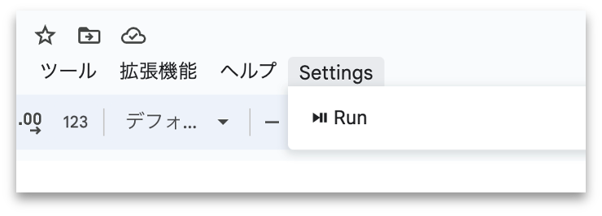

4. 最初実行時に承認が必要。（写真参照）  
  「続行」ボタンをクリック。  
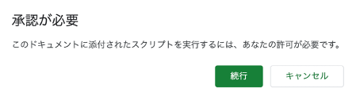
  
5. Googleアカウント選択。  
  「このアプリは Google で確認されていません」出た時に詳細」をクリック。  
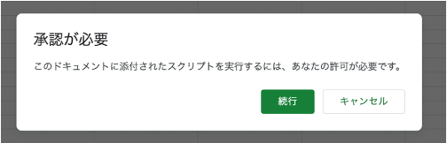

6. 「詳細」クリック後に「[GAS] MobileDeviceTemplate (安全ではないページ) に移動」をクリック。  
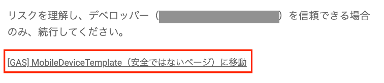

7. 最後に「許可」を選択。  
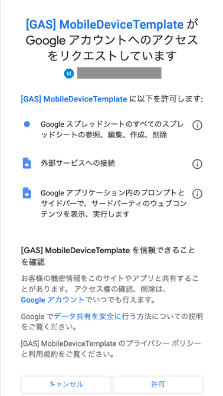

*初回実行時には、一括更新は実行されません。*  
*一括更新を行うには、「設定」>「実行」をもう一度選択する必要があります。*

## [Mass Updating](#mass-updating)
1. コピーしたスプレッドシートを開く。
2. 更新したいデータを入力する。
3. メニューでヘルプの右にある「設定」>「実行」を押下。  

更新中↓  
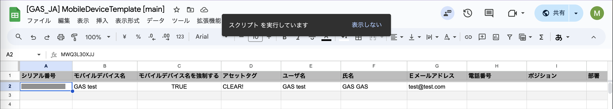

更新完了したら、右にログのサイドバーが開きます。
更新完了↓  
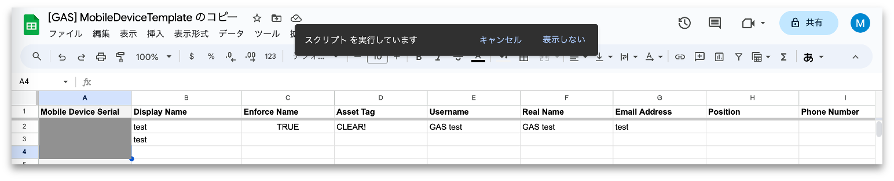

「設定」>「実行」ボタンを押すと、ときどき以下のエラーとなります。  
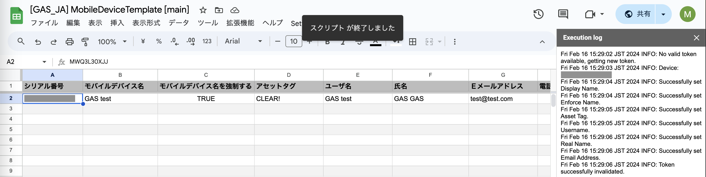  
この場合、以下を実行してみてください。  
「表示しない」をクリック。  
5-10秒を待つ。  
「設定」>「実行」をもう一度選択。  

## [Test Environments](#test-environment)
動作確認を行なった環境は以下です。

macOS 14.4.1  
・Google Chrome v.123.0.6312.59、日本語・英語  
・Firefox v.124.0.1 (64-bit)、日本語・英語  

iPadOS 16.7.7  
・Safari 16.7.7、英語 

Windows 11 (arm)  
・Google Chrome v.123.0.6312.59、日本語  
・Microsoft Edge v.122.0.2365.92、日本語

Windows 10 (x86)  
・Google Chrome v.123.0.6312.59、日本語・英語  
・Microsoft Edge v.122.0.2365.92、日本語・英語  
・Firefox v.124.0.1 (64-bit)、日本語・英語 

## [Support](#support)
技術的な問題が発生した場合は、このリポジトリに「Issue」を作成するか、[メール](mailto:support@magichat.jp)でお問い合わせください。