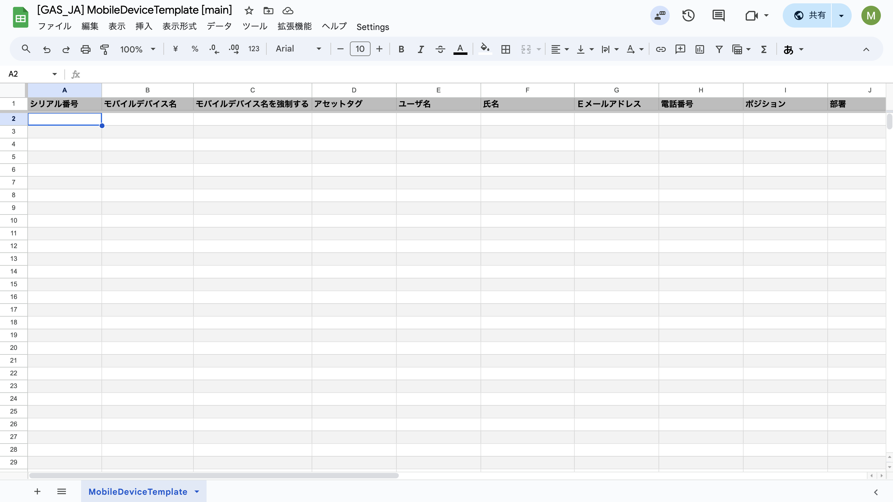
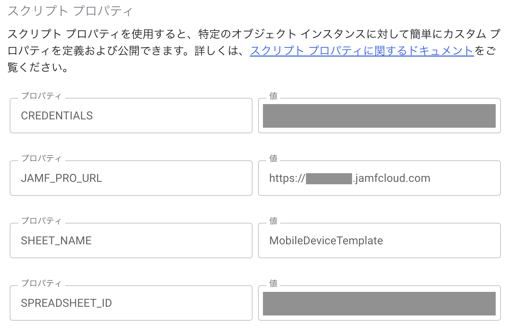
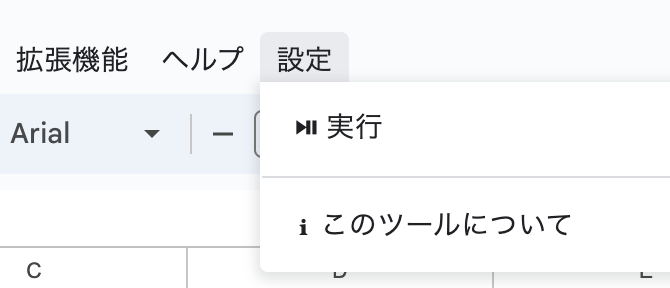
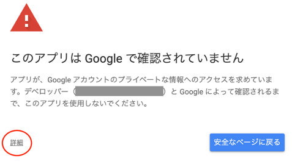
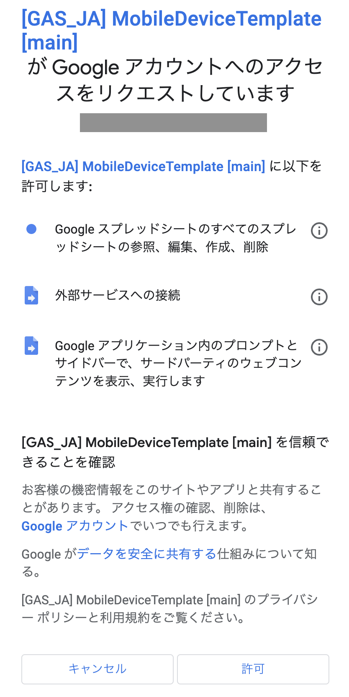
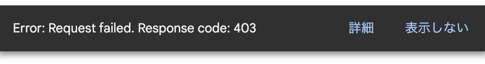
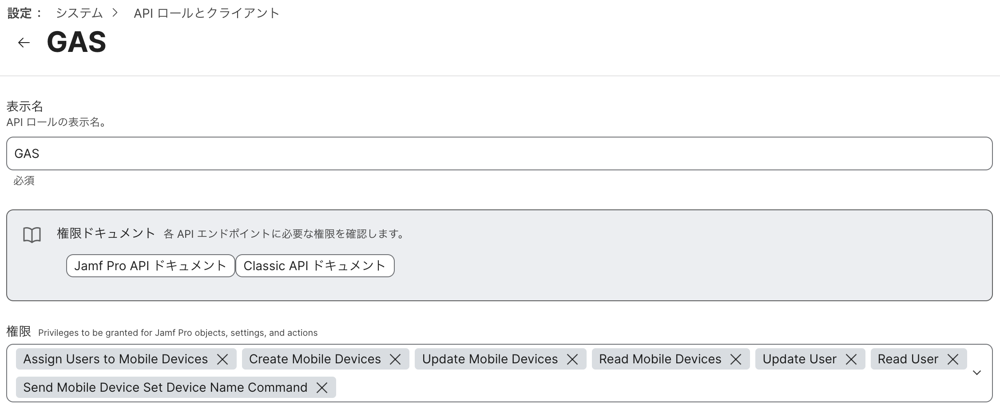

# GoogleAppsScript-for-Jamf
このプログラムは、スプレッドシート、Google Apps Script および Jamf Pro の API の組み合わせを利用します。  
スプレッドシート内の情報に基づいて、プログラムは API 呼び出しを行い、ユーザーが指定した Jamf Pro インスタンス内の関連情報を更新します。

**アップデートが意図したとおりに機能することを確認するために、最初は必ず数台のデバイスのみでテスト更新を実行してください。**

- [Introduction](#introduction)
- [Beginning Steps](#beginning-steps)
  - [Google Account](#google-account)   
  - [Jamf Pro](#jamf-pro)
    - [Basic Authorization](#basic-authorization)
    - [API Account](#api-account)
  - [Google Spreadsheet](#google-spreadsheet)
    - [Make A Copy](#make-a-copy)
    - [Initial Settings](#initial-settings)
- [Data Input](#data-input)
  - [Updating Attributes](#updating-attributes)
  - [Updating Extension Attributes](#updating-extension-attributes)
  - [Clearing Existing Attributes](#clearing-existing-attributes)
- [First Run](#first-run)
- [Mass Updating](#mass-updating)

## [Introduction](#introduction)
この一括更新ツールは、Webアプリケーション フレームワークである Google Apps Script(GAS) の下で JavaScript で書かれた Web アプリケーションです。これにより、Jamf 管理者は、Jamf 内のデバイス (iOS、iPadOS、tvOS 対象のみ) およびユーザーの属性 (ユーザー名、アセットタグ、または拡張属性など) を一括更新できます。 

ツールはブラウザー上で動きますので、OSと関係なく、Windows、macOS、iOS デバイスでも使うことは可能となります。

## [Beginning Steps](#beginning-steps)
このツールを使用するには、以下の手順を該当する順序で事前準備を行ってください。
### [Google Account](#google-account)
https://www.google.com/accounts/NewAccount にアクセスします。​指示に従ってアカウントを作成してください。
※既にアカウントをお持ちの場合は、新しいアカウントを作成する必要はありません。​[参照](https://support.google.com/accounts/answer/27441?hl=ja&ref_topic=3382296&sjid=12686068683038764892-AP​)

Googleアカウントにログインします。

### [Jamf Pro](#jamf-pro)
お使いの Jamf Proにおいて 初めて当作業を実施する際は以下を実施してください。

#### [Basic Authorization](#basic-authentication)
1. 画面左中の「⻭車マーク」をクリック。
2. 「Jamf Proユーザアカウントとグループ」をクリック。
3. 「Bearerトークン認証に加えて Basic認証を許可」に チェックを入れる。
4. 「保存」をクリック。

#### [API Account](#api-account)
Jamf Pro で API用ユーザアカウントを以下の様に作成します。

1. 画面左中の「⻭車マーク」をクリック。
2. 「Jamf Proユーザアカウントとグループ」をクリック。 
3. 画面右上の「新規」をクリック。 
4. 「Create Standard Account」に チェック、次へ押下。
5. アカウントタブにて以下を設定してください。
   - ユーザ名(例）：api-user
   - アクセスレベル：フルアクセス
   - 権限セット：カスタム
   - パスワード

6. 権限タブにて以下にチェックを付けてください。
   - **Jamf Proサーバオブジェクト**
     - Mobile Devices (作成・読み取り・アップデート）
     - ユーザ (読み取り・アップデート）
   - **Jamf Proサーバアクション**
     - モバイルデバイスへのユーザ割当
     - モバイルデバイス名称設定コマンドを送信
7. 「保存」をクリック。

### [Google Spreadsheet](#google-spreadsheet)

#### [Make A Copy](#make-a-copy)
1. 以下リンクにアクセス。
   - https://docs.google.com/spreadsheets/d/1fTqvaqtE9LxwskzQJHS6nNf19dpdizMRXHypr9010ak
2. ファイル > コピーを作成 にクリック。
3. ドキュメントをコピーのプップアップの設定。
   - 名前：変更可能
   - Apps Script ファイル：一括更新を動くために、スクリプトを使います。スクリプトを確認したい場合、クリックするとコードが開けます。
   - フォルダ：マイドライブ（そのままにしてください。）
4. 「 コピーを作成」にクリック。
5. コピーしたスプレッドシートは自動的に新しいタブで開けます。  
※ 使用しているGoogleアカウントのドライブにスプレッドシートは保存されますので、今後ドライブから開くことができます。

#### [Initial Settings](#initial-settings)
コピーしたスプレッドシートを開いて、以下の手順にそって初期設定を行ってください。

1. 拡張属性 > Apps Script にクリック。
2. 画面左中の「歯車マーク」をクリック。（プロジェクトの設定）
3. 下にある「スクリプト プロパティを追加」にクリック。
4. 以下の内容を設定して「保存」をクリック。

| プロパティ | 値 |
| :---   | :---   |
| CLASSIC_API_URL | https://インスタンス名.jamfcloud.com/JSSResource |
| JAMF_PRO_API_URL | https://インスタンス名.jamfcloud.com/api/ |
| CREDENTIALS | 作成したJamfAPIユーザー名:Jamfパスワード 例: ユーザー名がaaa、パスワードがbbbであれば 「aaa:bbb」となる。 |
| SHEET_NAME | MobileDeviceTemplate |
| SPREADSHEET_ID | コピーしたスプレッドシートID (取得方は以下の説明をご覧） |

スプレッドシート ID は URL から抽出できます。  
例えば、URLは https://docs.google.com/spreadsheets/d/abc1234567/edit#gid=0 の場合、 
スプレッドシート ID は「abc1234567」となります。

## [Data Input](#data-input)

一括更新を実行する時に、スプレッドシートのヘッダー行に対して検証チェックを実行します。一括更新を行う前に、ヘッダー行の変更 (列の削除や列の再配置など) しないようにしてください。 ヘッダー行に変更があれば、一括購入は正常に動かない可能性は高いです。

スプレッドシートの下にあるシート名「MobileDeviceTemplate」をそのままにしてください。

### [Updating Attributes](#updating-attributes)
スプレッドシートにある客ヘッダ名の使い方についてです。

- Mobile Device Serial [入力必須]
  - インベントリ情報を更新したいデバイスのシリアルナンバーを半角英数文字で入力する。 

**Jamf Pro にてインベントリ画面の「一般」タブで更新可能な項目**
- Display Name:「モバイルデバイス名」(実機のデバイス名も更新される)  
- Enforce Name:「モバイルデバイス名を強制する」
  - ユーザによってデバイス名が変更された場合、モバイルデバイス名は入力された値に戻る
  - 指定値に戻す →「TRUE」or そのままにする →「FALSE」
- Asset Tag:「アセットタグ」  
- Site:「サイト」
  - ID or サイト名
  - Jamf Pro に登録されていない「サイト」を入力した場合は更新されない。
- AirPlay Password (tvOS):「AirPlay パスワード」

**Jamf Pro にてインベントリ画面の「ユーザと位置」タブで更新可能な項目**
- Username:「ユーザ名」
- Real Name:「氏名」
- Email Address:「Ｅメールアドレス」
- Position:「ポジション」
- Phone Number:「電話番号」
- Department:「部署」
- Building:「建物」
- Room:「ルーム」

【注意事項】  
Department、Building については、Jamf Pro に登録されている  
 「部署」「建物」と同じ値 (文字列) を入力する必要がある。  
 Jamf Pro に登録されていない「部署」「建物」を入力した場合は更新されない。 

**Jamf Pro にてインベントリ画面の「購入」タブで更新可能な項目**
- PO Number:「購入番号」
- Vendor:「ベンダー」
- Purchase Price:「購入価格」
- PO Date:「購入日」
  - yyyy-mm-dd形
- Warranty Expires:「品質保証期限電」
  - yyyy-mm-dd形
- Is Leased:「購入またはリース」
  - 指定値に戻す →「TRUE」or そのままにする →「FALSE」
- Lease Expires:「リース有効期限」
  - yyyy-mm-dd形
- AppleCare ID:「AppleCare ID」

### [Updating Extension Attributes](#updating-extension-attributes)  
デバイス用の拡張属性を更新するのは可能です。  
まず拡張属性の ID を特定する必要があります。

1. 画面左中の「歯車マーク」をクリック。
2. デバイス管理 > 拡張属性を選択。
3. 更新する EA をクリック。
4. 該当 EA の URL から ID を取得する。

例えば、ここで表示されている拡張属性のEA IDは「17」です。  

拡張属性を更新するには、テンプレートの既存のすべての列の後に新しい列に独自のヘッダーを追加し、そのヘッダーに文字列「EA_#」を入力します。「#」は更新する EA の ID です。

たとえば、ID が「17」の拡張属性を更新するには、ヘッダーが「EA_17」の新しい列を追加し、その EA の値をその列に配置します。

スプレッドシートは次のようになります。  
(適合させるために一部の列が表示されていません。スプレッドシートから列を削除しないでください)。

| Mobile Device Serial | Display Name | Enforce Name | Asset Tag | ... | Site (ID or Name) | EA_17 | EA_18
| :---   | :---   |  :---   |  :---   |  :---   |  :---   |  :---  |  :---   |
| A1234567 | | TRUE | MH-12 | | | New Value | New Value |
| B1234567 | | FALSE | MH-15 | | | New Value | New Value |

### [Clearing Existing Attributes](#clearing-existing-attributes)  
ツールのもう 1 つの機能として、既存の属性をクリアすることはできます。  
たとえば、デバイスのグループが新しいユーザーに再配布されるか、廃止され、ユーザー名と関連情報を削除する必要がある場合に発生します。

値をクリアするには、特定の文字列を使用する必要があります。  
この文字列は現在「CLEAR!」です。

【注意事項】  
・ Display Name、Is Leased、PO Date、Warranty Expires、Lease Expires は対象外。

デバイスからユーザー情報を消去する場合、スプレッドシートは次のようになります (省略記号の後に列があります)。

| Mobile Device Serial | Display Name | Enforce Name | Asset Tag | ... | Site (ID or Name) | EA_17 | EA_18
| :---   | :---   |  :---   |  :---   |  :---   |  :---   |  :---  |  :---   |
| A1234567 | | CLEAR! | CLEAR! | | CLEAR! | CLEAR! | CLEAR! |
| B1234567 | | CLEAR! | CLEAR! | | CLEAR! | CLEAR! | CLEAR! |

## [First Run](#first-run)
1. コピーしたスプレッドシートを開く。
2. 更新したいデータを入力する。
3. メニューでヘルプの右にある Settings > Run を押下。

4. 最初実行時に承認が必要。（写真参照）  
  「続行」ボタンをクリック。

  
5. Googleアカウント選択。  
  「このアプリは Google で確認されていません」出た時に詳細」をクリック。  

6. 「詳細」クリック後に「[GAS] MobileDeviceTemplate (安全ではないページ) に移動」をクリック。

7. 最後に「許可」を押下。  

## [Mass Updating](#mass-updating)
1. コピーしたスプレッドシートを開く。
2. 更新したいデータを入力する。
3. メニューでヘルプの右にある Settings > Run を押下。  

更新中↓  

更新完了したら、右にログのサイドバーが開きます。
更新完了↓

Settings > Run ボタンを押すと、ときどき以下のエラーとなります。
  
この場合、以下をやってみてください。  
「表示しない」をクリック。  
5-10秒を待つ。  
Settings > Run をもう一度押下。  
